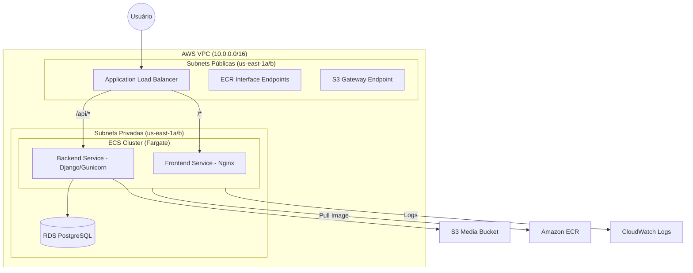

# Amparo Infrastructure (AMPARO_INFRA)

Este repositório contém a definição da infraestrutura como código (IaC) para o projeto **Amparo**, utilizando **Terraform** e **AWS**. A arquitetura foi desenhada para ser resiliente, segura e escalável, utilizando serviços gerenciados como ECS Fargate, RDS e S3.

## 🏗️ Arquitetura do Sistema

Abaixo está uma representação visual de como os componentes interagem dentro da AWS:



---

## 🛠️ Componentes Principais

### 1. Networking (VPC)
- **VPC**: Rede isolada com bloco CIDR `10.0.0.0/16`.
- **Subnets**: 
  - **Públicas**: Localizadas em `us-east-1a` e `us-east-1b`, com IPs públicos automáticos para serviços que precisam de saída direta ou entrada (ALB).
  - **Privadas**: Isoladas da internet, usadas para o banco de dados e camadas sensíveis.
- **VPC Endpoints**: Configurados para permitir que o ECS Fargate acesse o **ECR**, **S3** e **CloudWatch Logs** de forma segura e privada, reduzindo custos de NAT Gateway.

### 2. Compute (ECS Fargate)
- **Cluster**: `amparo-cluster`.
- **Serviços**:
  - **Backend**: Container Django rodando na porta 8000. Integrado com RDS e S3.
  - **Frontend**: Container Nginx rodando na porta 80.
- **Auto Scaling**: Ambos os serviços possuem políticas de escalonamento baseadas em uso de CPU e Memória (alvo de 70%), com capacidade de expandir horizontalmente conforme a demanda.

### 3. Load Balancing (ALB)
- O **Application Load Balancer** expõe a aplicação na porta 80.
- **Regras de Roteamento**:
  - Caminhos iniciados em `/api/*` são encaminhados para o serviço de Backend.
  - O tráfego padrão (restante) é encaminhado para o Frontend.

### 4. Database (RDS PostgreSQL)
- **Instância**: PostgreSQL 16 (`db.t3.micro`).
- **Segurança**: Localizado em subnets privadas. O Security Group permite acesso apenas via porta 5432 vindo de dentro da VPC.
- **Configuração**: Gerenciado via variáveis (`db_name`, `db_username`, `db_password`).

### 5. Storage (S3)
- **Bucket de Mídia**: Usado para armazenar uploads do usuário.
- **Políticas**:
  - `PublicReadGetObject`: Permite leitura pública de objetos para entrega direta de imagens/mídias.
  - **CORS**: Configurado para permitir requisições de origens autorizadas.
- **IAM**: O Backend possui permissão específica (`s3:PutObject`, `s3:GetObject`, etc.) via IAM Task Role.

---

## 🔐 Segurança e Políticas

- **IAM Roles**: 
  - `amparo-ecs-task-execution-role`: Usada pelo agent do ECS para gerenciar ciclos de vida de tarefas, puxar imagens e enviar logs.
  - **S3 Access Policy**: Anexada à role das tasks para permitir que o app interaja com o bucket de mídia.
- **Security Groups**:
  - `alb_sg`: Abre apenas a porta 80 para o mundo.
  - `ecs_tasks_sg`: Permite tráfego apenas vindo do ALB.
  - `rds_sg`: Permite tráfego apenas na porta 5432 vindo da VPC.
  - `vpc_endpoints_sg`: Permite HTTPS interno para comunicação com serviços AWS.

---

## 🚀 Como Utilizar

### Pré-requisitos
1. **Terraform CLI** instalado.
2. Credenciais AWS configuradas.
3. Arquivo `secrets.auto.tfvars` preenchido com as variáveis sensíveis (veja `variables.tf`).

### Comandos Básicos
```bash
# Inicializa o projeto (instala providers e módulos)
terraform init

# Verifica as mudanças que serão aplicadas
terraform plan

# Aplica a infraestrutura
terraform apply
```

Ao final do `apply`, o DNS do Load Balancer será exibido no output `alb_dns_name`.

---

## 📝 Variáveis Importantes
As seguintes variáveis devem ser definidas para o sucesso do build:
- `db_username` / `db_password`: Credenciais do banco.
- `django_secret_key`: Chave mestra do Django.
- `aws_bucket_name`: Nome único para o bucket S3 de mídias.
- `aws_access_key_id` / `aws_secret_access_key`: Chaves de acesso para o backend (se necessário via ENV).
